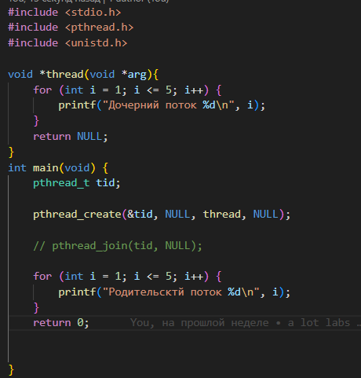
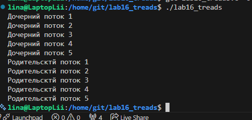
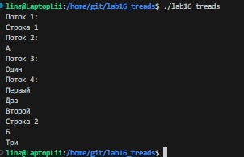
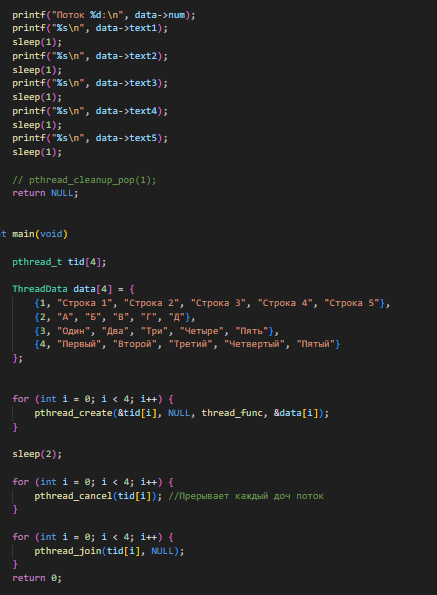
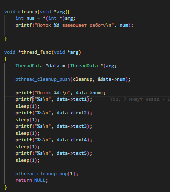
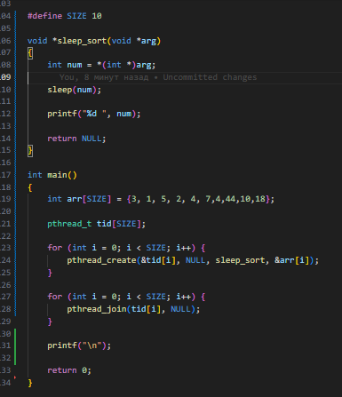

# Лабораторная работа: pthread (Потоки в C)

## Цель работы
Изучить создание, синхронизацию и завершение потоков с использованием библиотеки pthread, а также реализовать алгоритм Sleepsort.

---

# 1. Создание потока (pthread_create)

## Описание
Создан один дочерний поток и основной поток. Оба выводят по 5 строк.

## Результат

---

# 2. Ожидание потока (pthread_join)

## Описание
Основной поток ожидает завершения дочернего перед продолжением работы.

## Результат

---

# 3. Параметры потоков

## Описание
Созданы 4 потока, каждому передан свой набор строк.

Каждый поток выводит уникальную последовательность.

## Результат

---

# 4. Завершение потоков (pthread_cancel)

## Описание
Потоки выполняют sleep() между выводами.

Основной поток через 2 секунды завершает все потоки с помощью pthread_cancel().

## Результат

---

# 5. Обработка завершения (pthread_cleanup_push)

## Описание
Добавлена функция cleanup, которая выполняется при завершении потока.

Теперь поток перед отменой выводит сообщение о завершении.

## Результат

---

# 6. Sleepsort

## Описание
Для каждого элемента массива создается поток.

Поток "засыпает" на время, равное значению числа, затем выводит его.

Это даёт сортировку по возрастанию.

## Результат

---

# Вывод
В ходе лабораторной работы были изучены:
- создание потоков
- ожидание завершения потоков
- передача параметров
- принудительное завершение потоков
- обработка завершения
- алгоритм Sleepsort

Работа потоков позволяет выполнять задачи параллельно, однако требует синхронизации.